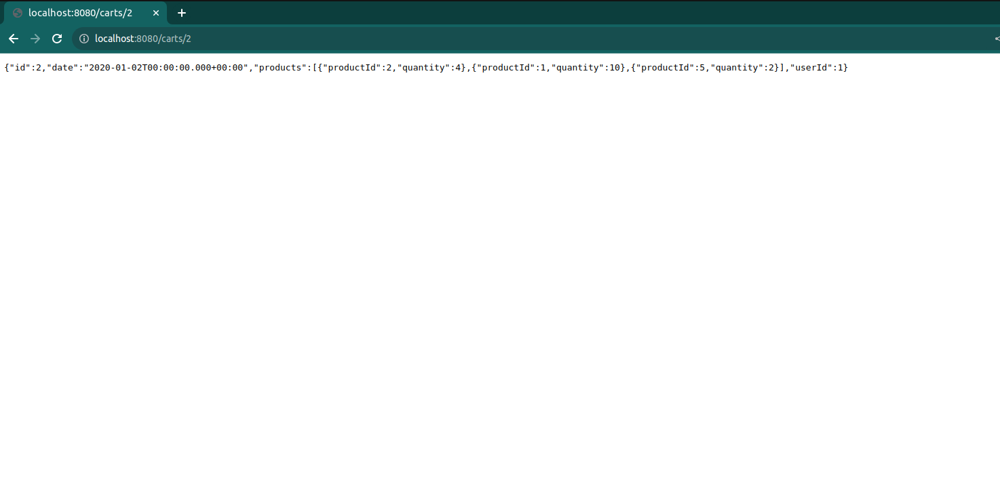

What You Need:
    About 15 minutes
A favorite text editor or IDE
    Java 1.8 or later
    Gradle 7.5+ or Maven 3.5+
You can also import the code straight into your IDE:
    Spring Tool Suite (STS)
    IntelliJ IDEA
    VSCode

Clone my project from github and start with sprint initializr
To manually initialize the project:

Navigate to https://start.spring.io. This service pulls in all the dependencies you need for an application and does most of the setup for you.

Choose either Gradle or Maven and the language you want to use. This guide assumes that you chose Java.

Click Dependencies and select Spring Web.

Click Generate.

Download the resulting ZIP file, which is an archive of a web application that is configured with your choices.

//The Spring Initializr creates a main class that you can use to launch the application. 

Then go to "localhost:8080" and keep making small changes to the url to try all the functionalities. For example: 
1-> to view the whole cart, add "/cart" to the local host url

2-> to view just a single product, add "/cart/2" ,here 2 is the id of the product.

there are more functionalities like delete,post,put,patch
do try them!